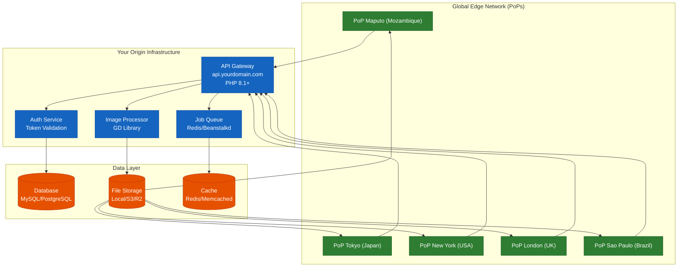
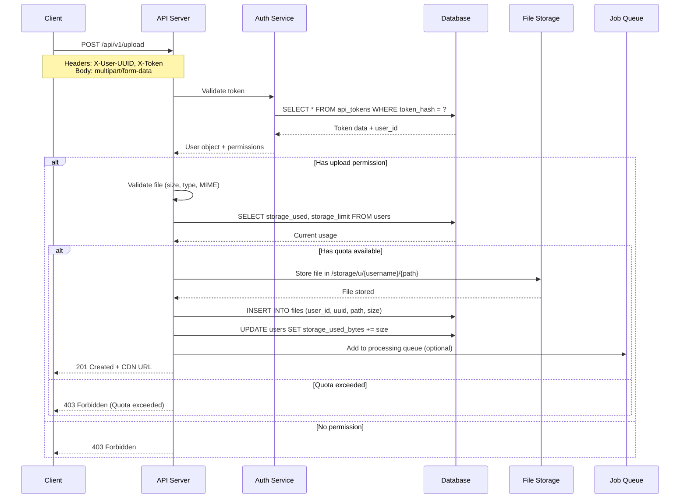
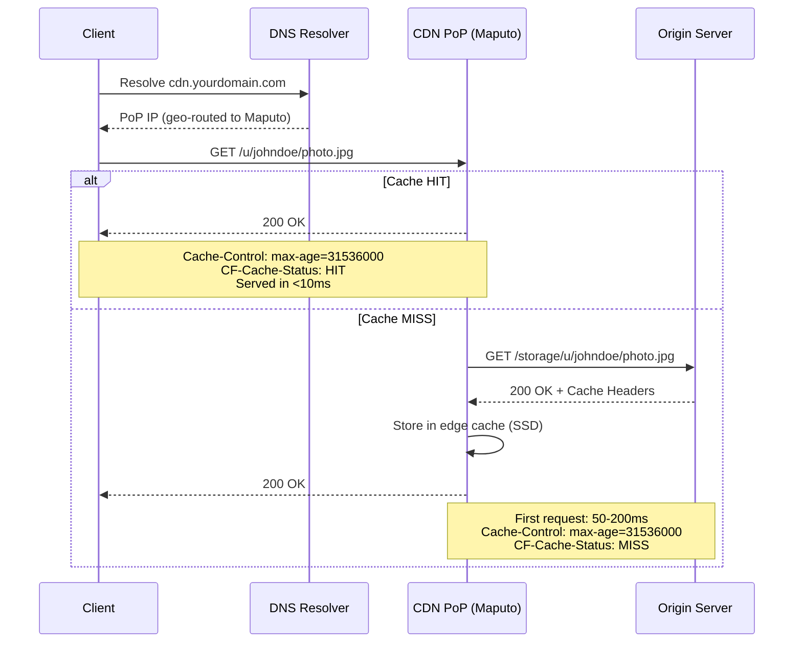
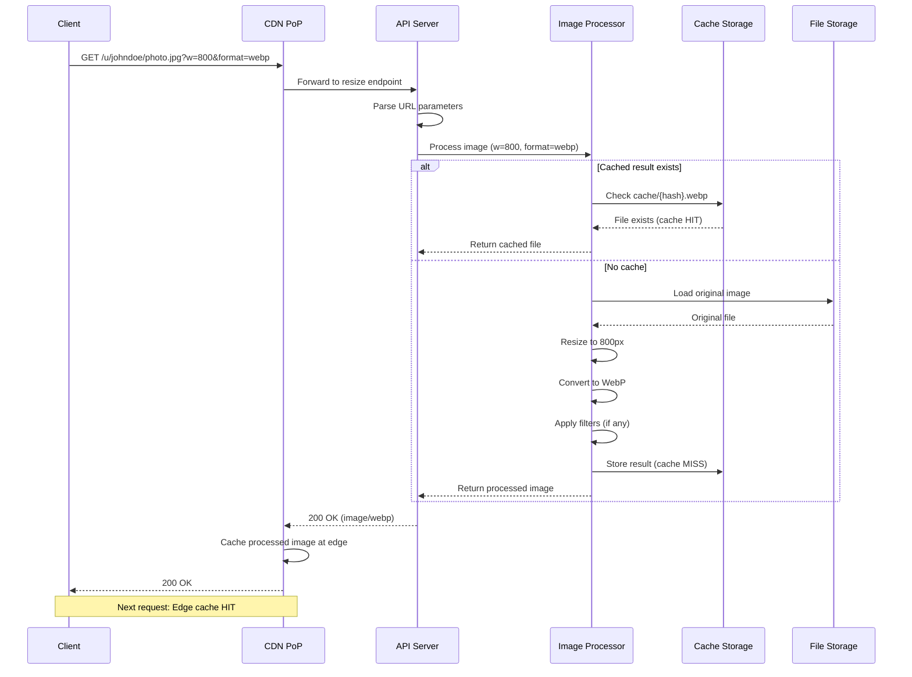
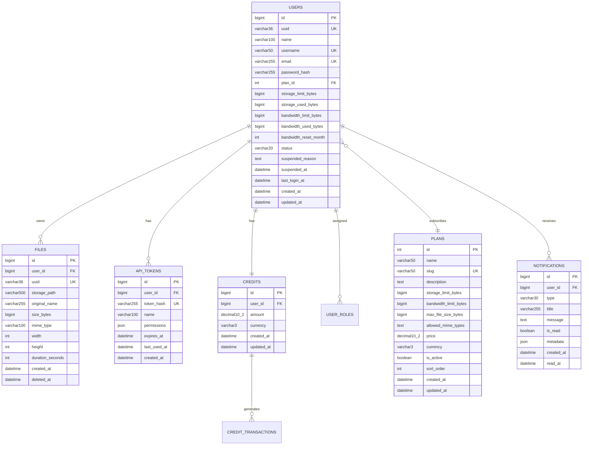
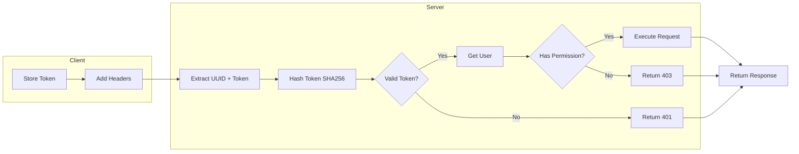
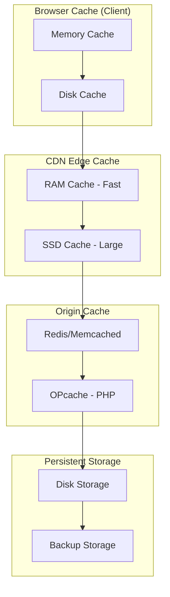
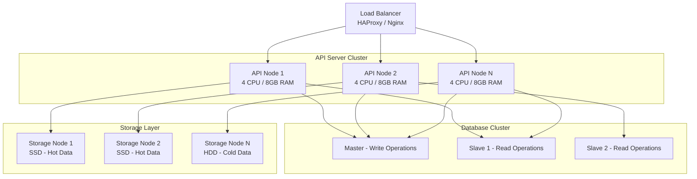
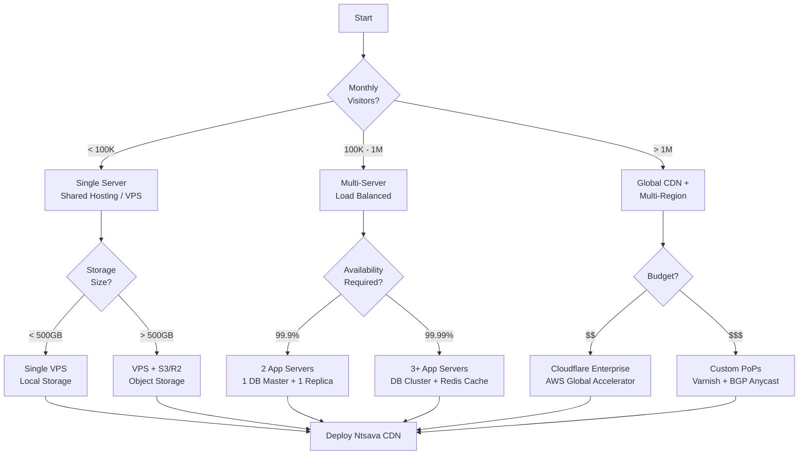

# Ntsava CDN Architecture

## System Architecture Overview

A complete content delivery network platform with separation of concerns, global edge caching, and multi-tenant isolation.

### High-Level Architecture

```
[Global Edge Network - 300+ Points of Presence]
                          |
                          v
              [Cloudflare / Bunny / AWS / Custom]
                          |
                          v
              [Your Origin Infrastructure]
    +------------------+------------------+
    |                  |                  |
    v                  v                  v
[API Server]      [Storage]          [Database]
 api.domain        cdn.domain         MySQL/PgSQL
```

### Three-Tier Architecture Diagram



## Component Breakdown

### 1. Edge Layer (CDN Points of Presence)

The edge layer consists of geographically distributed cache servers that serve content from locations closest to end users.

**Characteristics:**
- Geographic distribution: 300+ global locations (including Maputo, Mozambique)
- Cache storage: SSD/NVMe (varies by provider)
- Cache duration: Configurable (1 hour to 1 year)
- Eviction policy: LRU (Least Recently Used)
- SSL termination: At edge (free certificates with most providers)

**Supported CDN Providers:**

| Provider | Points of Presence | Free Tier | Best For |
|----------|-------------------|-----------|----------|
| Cloudflare | 300+ (including Maputo) | Unlimited bandwidth | General purpose, DDoS protection |
| Bunny.net | 120+ | $1 trial | Video streaming, gaming assets |
| AWS CloudFront | 400+ | 1TB/month free | AWS ecosystem integration |
| Akamai | 4,000+ | Enterprise only | Financial, healthcare, high security |
| Custom Varnish | Self-managed | Depends on infrastructure | Complete control, compliance |

### 2. Application Layer (API Origin)

The application layer handles all dynamic operations: upload, delete, authentication, and image processing.

**Directory Structure:**
```
app/
├── Core/                    # Core abstractions
│   ├── Auth.php            # Session/token management
│   ├── Uploader.php        # File handling and validation
│   ├── Mailer.php          # Email notifications
│   └── ORMHelper.php       # Database abstraction
├── Middleware/              # Request filters
│   └── ApiAuthMiddleware.php
└── router/                  # Route definitions (file-based)
    ├── api/v1/
    │   ├── upload.php
    │   ├── delete.php
    │   ├── info.php
    │   └── resize.php
    └── dashboard/           # Web interface routes
```

**Technology Stack Details:**
- Framework: Fluxor PHP (file-based routing, security-first)
- ORM: Cycle ORM (DataMapper pattern, database agnostic)
- Image Processing: GD Library (no external dependencies)

### 3. Data Layer

The data layer consists of three complementary storage systems.

**Primary Database (MySQL/PostgreSQL):**

```sql
-- Optimized indexes for high throughput
CREATE INDEX idx_files_user_deleted ON files(user_id, deleted_at);
CREATE INDEX idx_tokens_hash_user ON api_tokens(token_hash, user_id);
CREATE INDEX idx_bandwidth_reset ON users(bandwidth_reset_month);
CREATE INDEX idx_notifications_user_read ON notifications(user_id, is_read);
```

**File Storage Structure:**
```
storage/
├── u/                      # User storage root
│   ├── {username}/         # Per-user directory (isolated)
│   │   ├── {path}/         # User-defined folders
│   │   │   └── {files}
│   │   └── ...
│   └── ...
└── cache/                  # Resized images cache
    ├── {md5_hash}.webp
    ├── {md5_hash}.jpg
    └── ...
```

## Request Flows

### Flow 1: File Upload



### Flow 2: File Access with CDN Caching



### Flow 3: Image Processing with Caching



## Database Schema

### Entity Relationship Diagram



### Indexing Strategy

```sql
-- Performance-critical indexes for high-traffic scenarios
CREATE INDEX idx_files_user_deleted ON files(user_id, deleted_at);
CREATE INDEX idx_files_created ON files(created_at DESC);
CREATE INDEX idx_tokens_hash ON api_tokens(token_hash);
CREATE INDEX idx_tokens_user_expires ON api_tokens(user_id, expires_at);
CREATE INDEX idx_users_bandwidth_reset ON users(bandwidth_reset_month);
CREATE INDEX idx_users_status_plan ON users(status, plan_id);
CREATE INDEX idx_notifications_user_unread ON notifications(user_id, is_read);
CREATE INDEX idx_credits_user ON credits(user_id);
CREATE INDEX idx_transactions_user_created ON credit_transactions(user_id, created_at);
```

## Database Agnostic Design

Ntsava uses Cycle ORM which provides database abstraction. The same code works on:

| Database | Version | Tested | Production Ready |
|----------|---------|--------|------------------|
| MySQL | 5.7+ | Yes | Yes |
| MariaDB | 10.2+ | Yes | Yes |
| PostgreSQL | 12+ | Yes | Yes |
| SQLite | 3.35+ | Yes | Development only |

**Configured drivers** (`db/core/connection.php`):

| Database | Version | Tested | Production Ready |
|----------|---------|--------|------------------|
| MySQL | 5.7+ | Yes | Yes |
| MariaDB | 10.2+ | Yes | Yes |
| SQLite | 3.35+ | Yes | Development only |

All queries use ORM methods — no vendor-specific SQL:

```php
$users = ORMHelper::getRepository(User::class)
    ->findAll(['status' => 'active']);

$file = ORMHelper::findOneBy(File::class, 'uuid', $uuid);
```

## Security Model

### Authentication Flow



### Permission Matrix

| Operation | Required Permission | Token Types | Rate Limit (per hour) |
|-----------|--------------------|-------------|----------------------|
| Upload file | `upload` | API, Web | 100 |
| Delete file | `delete` | API, Web | 50 |
| Get file info | `read` | API, Web | 1000 |
| List files | `read` | API, Web | 100 |
| Generate token | `admin` | Web only | 10 |
| Delete account | `owner` | Web only | 1 |

### Security Headers Configuration

```apache
# .htaccess security headers (Apache)
Header set X-Content-Type-Options "nosniff"
Header set X-Frame-Options "DENY"
Header set X-XSS-Protection "1; mode=block"
Header set Referrer-Policy "strict-origin-when-cross-origin"
Header set Content-Security-Policy "default-src 'self'"
Header set Strict-Transport-Security "max-age=31536000; includeSubDomains"
```

```nginx
# Nginx security headers
add_header X-Content-Type-Options "nosniff" always;
add_header X-Frame-Options "DENY" always;
add_header X-XSS-Protection "1; mode=block" always;
add_header Referrer-Policy "strict-origin-when-cross-origin" always;
```

## Caching Strategy

### Multi-Level Cache Architecture



### Cache Headers by Content Type

| Content Type | Cache TTL | CDN TTL | Browser TTL | Stale-While-Revalidate |
|--------------|-----------|---------|-------------|------------------------|
| Images (JPEG/PNG) | 1 year | 30 days | 7 days | 1 day |
| Images (WebP/AVIF) | 1 year | 30 days | 7 days | 1 day |
| Videos (MP4/WebM) | 1 year | 90 days | 30 days | 7 days |
| CSS/JavaScript | 1 year | 30 days | 7 days | 1 hour |
| API Responses | No cache | No cache | No cache | N/A |
| HTML pages | 1 hour | 1 hour | 1 hour | 5 minutes |

### Cache Invalidation

**CDN edge cache:** Governed by `Cache-Control: public, max-age=31536000, immutable` headers set in `storage/.htaccess`. No programmatic CDN purge is implemented. Stale content is avoided by appending a 6-character random suffix to every uploaded filename (e.g., `photo_a1b2c3.jpg`), so each upload gets a unique URL.

**Resize cache (`storage/cache/`):** Automatically pruned on each `ResizeService` instantiation — any cached file older than 7 days is deleted before serving new requests.

## Scalability Patterns

### Horizontal Scaling Architecture



### Auto-Scaling Triggers

```
Scale Up (Add nodes):
  - CPU usage > 70% for 5 minutes
  - Memory usage > 80% for 5 minutes
  - Requests per second > 1000 per node
  - Queue length > 10,000 pending jobs
  - Response time > 500ms for 5 minutes

Scale Down (Remove nodes):
  - CPU usage < 30% for 30 minutes
  - Memory usage < 50% for 30 minutes
  - Requests per second < 100 per node
  - Minimum 2 nodes running (high availability)
```

### Geographic Data Distribution

```
Hot Storage (SSD - 3x replication):
  - Recent files (< 30 days old)
  - Frequently accessed (> 100 views/day)
  - Replicated to 3 geographic regions
  - Access time: < 10ms

Warm Storage (HDD - 2x replication):
  - Older files (30-365 days old)
  - Infrequently accessed (10-100 views/day)
  - Replicated to 2 regions
  - Access time: 20-50ms

Cold Storage (Archive - 1x + backup):
  - Old files (> 365 days old)
  - Rarely accessed (< 10 views/day)
  - Single region + offline backup
  - Access time: 100-500ms (retrieval from archive)
```

## Monitoring & Observability

### Key Performance Indicators (KPIs)

```
Application Metrics:
  - Request rate (by endpoint: upload, delete, info, resize)
  - Error rate (4xx client errors, 5xx server errors)
  - Response time (p50, p95, p99 percentiles)
  - Active users (by plan: Free, Plus, Pro, Business)
  - Storage usage (per user, per plan, global total)
  - Bandwidth consumption (per user, per region)

CDN Metrics:
  - Cache hit ratio (per Point of Presence)
  - Bandwidth served (edge vs origin comparison)
  - Popular content (top 100 files by requests)
  - Geographic distribution (requests by country/city)
  - PoP performance (latency by location: Maputo, Tokyo, etc.)

Infrastructure Metrics:
  - CPU / Memory usage per node
  - Database connection pool utilization
  - Disk I/O and available space
  - Network throughput (inbound/outbound)
```

### Health Verification

There is no dedicated `/api/v1/health` endpoint. To verify the application is up, send a request to the root and confirm an HTTP 200 response:

```bash
curl -I https://api.yourdomain.com/
# Expected: HTTP/2 200
```

To verify database connectivity directly:

```bash
php -r "new PDO('mysql:host=localhost;dbname=ntsava_cdn', 'user', 'pass');"
echo $?  # 0 = success
```

## Best Practices

### Performance Optimization

1. Use CDN caching for all static assets (images, videos, CSS, JS)
2. Enable compression (Brotli preferred over Gzip, 20-30% better)
3. Implement lazy loading for images below the fold
4. Use modern formats (WebP/AVIF) with JPEG/PNG fallback
5. Set appropriate cache TTLs based on content volatility
6. Monitor cache hit ratios daily, investigate if below 85%

### Security Hardening

1. Block PHP execution in storage directory completely
2. Validate file types by MIME, not just file extension
3. Implement rate limiting per token and per user
4. Use prepared statements (ORM handles this automatically)
5. Encrypt sensitive data (tokens, API keys, personal info)
6. Run regular security audits (monthly recommended)

### Cost Optimization

1. Leverage CDN free tiers (Cloudflare offers unlimited)
2. Use S3/R2-compatible storage for cost-effective archiving
3. Implement lifecycle policies (auto-delete files older than X days)
4. Monitor bandwidth usage by user, alert on anomalies
5. Compress images on upload (reduce origin storage costs)
6. Remove unused cached files weekly (cron job)

## Deployment Architecture Decision Tree



---

## Summary

Ntsava CDN provides a production-ready, database-agnostic content delivery platform that scales from a single server to global edge networks. The architecture emphasizes:

- Separation of concerns (API vs static storage)
- Database agnosticism (MySQL, PostgreSQL, SQLite)
- CDN agnosticism (Cloudflare, Bunny, AWS, Akamai, Custom)
- Security-first design (token auth, permissions, validation)
- Performance optimization (multi-level caching, CDN edge)
- Monitoring and observability (health checks, metrics)

[Back to Top](#ntsava-cdn-architecture)