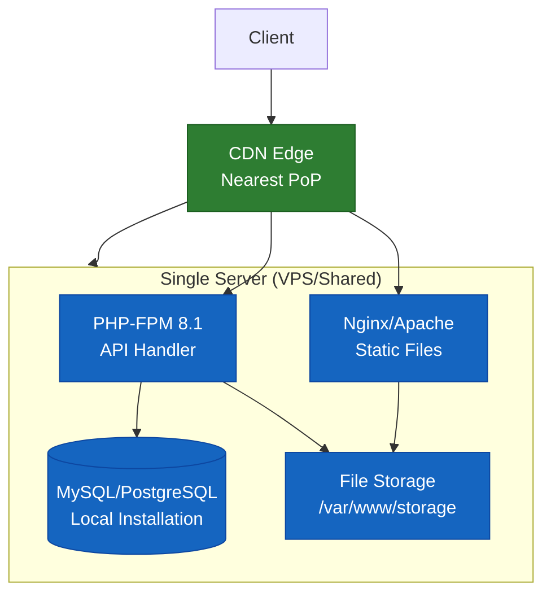
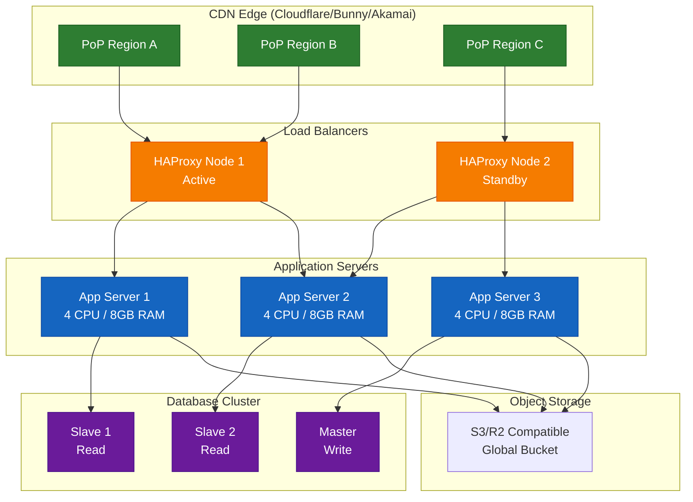

# Ntsava CDN Deployment Guide

## Production Deployment Strategies, PoP Configuration, and Global Scaling

This guide covers advanced deployment scenarios from multi-server setups to global edge networks with custom Points of Presence.

---

## Table of Contents

1. [Deployment Planning](#deployment-planning)
2. [Single Server Deployment](#single-server-deployment)
3. [Multi-Server Deployment](#multi-server-deployment)
4. [CDN Provider Deep Dive](#cdn-provider-deep-dive)
5. [Custom Point of Presence (PoP) Configuration](#custom-point-of-presence-pop-configuration)
6. [Load Balancing Strategies](#load-balancing-strategies)
7. [High Availability Architecture](#high-availability-architecture)
8. [Database Clustering](#database-clustering)
9. [Monitoring & Alerting](#monitoring--alerting)
10. [Disaster Recovery](#disaster-recovery)
11. [Deployment Checklist](#deployment-checklist)

---

## Deployment Planning

### Decision Matrix by Scale

| Requirement | Single Server | Multi-Server | Global CDN | Custom PoPs |
|-------------|---------------|--------------|------------|-------------|
| Monthly Visitors | < 100K | 100K - 1M | 1M - 10M | > 10M |
| Storage Needed | < 500GB | 500GB - 5TB | 5TB - 50TB | > 50TB |
| Monthly Budget | $0 - $50 | $100 - $500 | $500 - $5000 | $5000+ |
| Latency Requirement | < 200ms | < 100ms | < 50ms | < 20ms |
| Availability SLA | 99% | 99.9% | 99.99% | 99.999% |
| Team Size | 1 person | 2-3 people | 5+ people | 10+ people |

### Infrastructure Cost Estimator

```
Monthly Costs Calculation:

Shared Hosting:
  - Base: $5-15/month
  - Storage: included (unlimited but throttled)
  - Bandwidth: included
  - Suitable for: < 10K requests/day

VPS (DigitalOcean, Vultr, Linode):
  - Base: $10-20/month (2GB RAM, 1 CPU)
  - Storage: $0.10/GB (block storage)
  - Bandwidth: 1-2TB free, then overage
  - Suitable for: 10K-100K requests/day

Dedicated Server:
  - Base: $100-300/month (16GB RAM, 4+ CPU)
  - Storage: included (2x1TB SSD)
  - Bandwidth: 10-20TB free
  - Suitable for: 100K-500K requests/day

Cloud (AWS, GCP, Azure):
  - Compute: $50-200/month
  - Storage (S3/R2): $0.023/GB
  - CDN (CloudFront): $0.085/GB
  - Database (RDS): $50-300/month
  - Suitable for: 500K+ requests/day

CDN Services:
  - Cloudflare: Free - $200/month
  - Bunny.net: $0.01-0.05/GB
  - AWS CloudFront: $0.085/GB
  - Custom PoPs: $500-5000/month per location
```

### Geographic Distribution Strategy

```
Tier 1 Locations (Primary PoPs):
  - North America: New York, Los Angeles, Dallas, Chicago
  - Europe: London, Frankfurt, Amsterdam, Paris
  - Asia: Tokyo, Singapore, Mumbai, Seoul
  - South America: Sao Paulo, Buenos Aires, Santiago
  - Oceania: Sydney, Auckland

Tier 2 Locations (Secondary PoPs):
  - Middle East: Dubai, Tel Aviv, Riyadh
  - Africa: Johannesburg, Nairobi, Cairo, Lagos
  - Eastern Europe: Warsaw, Moscow, Istanbul
  - Southeast Asia: Jakarta, Bangkok, Hanoi
```

---

## Single Server Deployment

### Architecture Diagram



## Multi-Server Deployment

### Architecture Diagram



### Terraform Configuration

```hcl
# terraform/main.tf
terraform {
  required_version = ">= 1.0"
  required_providers {
    digitalocean = {
      source  = "digitalocean/digitalocean"
      version = "~> 2.0"
    }
    aws = {
      source  = "hashicorp/aws"
      version = "~> 5.0"
    }
  }
}

provider "digitalocean" {
  token = var.do_token
}

provider "aws" {
  region = var.aws_region
  access_key = var.aws_access_key
  secret_key = var.aws_secret_key
}

# Application servers
resource "digitalocean_droplet" "app" {
  count  = var.app_server_count
  image  = "ubuntu-22-04-x64"
  name   = "ntsava-app-${count.index + 1}"
  region = var.region
  size   = var.instance_size
  
  ssh_keys = [data.digitalocean_ssh_key.default.id]
  user_data = templatefile("user-data.sh", {
    db_host = digitalocean_database_cluster.mysql.host
    db_password = digitalocean_database_cluster.mysql.password
  })
}

# Managed database cluster
resource "digitalocean_database_cluster" "mysql" {
  name       = "ntsava-db-cluster"
  engine     = "mysql"
  version    = "8"
  size       = "db-s-4vcpu-8gb"
  region     = var.region
  node_count = 3
}

# Read replicas
resource "digitalocean_database_replica" "replicas" {
  count      = var.replica_count
  name       = "ntsava-db-replica-${count.index + 1}"
  cluster_id = digitalocean_database_cluster.mysql.id
  region     = var.replica_regions[count.index]
  size       = "db-s-2vcpu-4gb"
}

# Object storage
resource "digitalocean_spaces_bucket" "storage" {
  name   = "ntsava-storage"
  region = var.region
  
  versioning {
    enabled = true
  }
  
  lifecycle_rule {
    id      = "archive-old-files"
    enabled = true
    
    expiration {
      days = 90
    }
    
    transition {
      days          = 30
      storage_class = "STANDARD_IA"
    }
  }
  
  cors_rule {
    allowed_headers = ["*"]
    allowed_methods = ["GET", "PUT", "POST", "DELETE"]
    allowed_origins = ["https://cdn.${var.domain}", "https://api.${var.domain}"]
    max_age_seconds = 3000
  }
}

# Load balancer
resource "digitalocean_loadbalancer" "global" {
  name   = "ntsava-global-lb"
  region = var.region
  
  forwarding_rule {
    entry_port     = 443
    entry_protocol = "https"
    target_port    = 80
    target_protocol = "http"
    certificate_id = digitalocean_certificate.ssl.id
  }
  
  healthcheck {
    port     = 80
    protocol = "http"
    path     = "/health"
    check_interval_seconds = 10
    response_timeout_seconds = 5
    unhealthy_threshold = 3
    healthy_threshold = 2
  }
  
  droplet_ids = digitalocean_droplet.app[*].id
}
```

### HAProxy Load Balancer Configuration

```haproxy
# /etc/haproxy/haproxy.cfg
global
    log /dev/log local0
    log /dev/log local1 notice
    maxconn 10000
    user haproxy
    group haproxy
    daemon
    stats socket /run/haproxy/admin.sock mode 660 level admin
    stats timeout 30s

defaults
    log global
    mode http
    option httplog
    option dontlognull
    option http-server-close
    option forwardfor except 127.0.0.0/8
    option redispatch
    retries 3
    timeout http-request 10s
    timeout queue 1m
    timeout connect 10s
    timeout client 1m
    timeout server 1m
    timeout http-keep-alive 10s
    timeout check 10s
    maxconn 3000

# Frontend: HTTPS termination
frontend https_front
    bind *:443 ssl crt /etc/ssl/private/yourdomain.pem alpn h2,http/1.1
    bind *:80
    redirect scheme https if !{ ssl_fc }
    
    # HTTP/2 support
    bind *:443 ssl crt /etc/ssl/private/yourdomain.pem alpn h2,http/1.1
    
    # Security headers
    http-response set-header Strict-Transport-Security "max-age=31536000; includeSubDomains; preload"
    http-response set-header X-Content-Type-Options "nosniff"
    http-response set-header X-Frame-Options "DENY"
    http-response set-header X-XSS-Protection "1; mode=block"
    
    # Rate limiting by IP
    stick-table type ip size 1m expire 10m store http_req_rate(10s)
    http-request track-sc0 src
    http-request deny deny_status 429 if { sc_http_req_rate(0) gt 100 }
    
    # Geographic routing based on Cloudflare header
    acl is_region_a hdr_sub(CF-IPCountry) -i US CA
    acl is_region_b hdr_sub(CF-IPCountry) -i GB FR DE
    acl is_region_c hdr_sub(CF-IPCountry) -i JP SG AU
    
    use_backend region_a_servers if is_region_a
    use_backend region_b_servers if is_region_b
    use_backend region_c_servers if is_region_c
    default_backend region_b_servers

# Backend: Region A
backend region_a_servers
    balance roundrobin
    option httpchk GET /health HTTP/1.0
    http-check expect string "healthy"
    
    server app1 10.0.1.10:80 check inter 3000 rise 2 fall 3 weight 3
    server app2 10.0.1.11:80 check inter 3000 rise 2 fall 3 weight 2
    
    stick-table type ip size 1m expire 30m
    stick on src

# Backend: Region B
backend region_b_servers
    balance leastconn
    option httpchk GET /health HTTP/1.0
    
    server app1 10.0.2.10:80 check inter 3000 rise 2 fall 3 weight 5
    server app2 10.0.2.11:80 check inter 3000 rise 2 fall 3 weight 4
    server app3 10.0.2.12:80 check inter 3000 rise 2 fall 3 weight 3 backup

# Backend: Region C
backend region_c_servers
    balance roundrobin
    
    server app1 10.0.3.10:80 check inter 3000 rise 2 fall 3
    server app2 10.0.3.11:80 check inter 3000 rise 2 fall 3

# Statistics page
listen stats
    bind *:8404
    stats enable
    stats uri /stats
    stats auth admin:secure_password_here
    stats refresh 10s
```

---

## CDN Provider Deep Dive

### Provider Comparison Matrix

| Feature | Cloudflare | Bunny.net | AWS CloudFront | Akamai | Custom Varnish |
|---------|------------|-----------|----------------|--------|----------------|
| Points of Presence | 300+ | 120+ | 400+ | 4,000+ | Self-managed |
| Free Tier | Unlimited bandwidth | $1 trial | 1TB/month | None | Depends on infra |
| Pay-as-you-go | Yes (Pro $20/mo) | Yes | Yes | Enterprise only | Yes |
| DDoS Protection | Yes (Free) | Add-on | Shield ($3k/mo) | Included | Self-implement |
| Image Optimization | Paid ($0.50/1K) | Paid | Lambda@Edge | Included | Self-implement |
| Custom SSL | Free | Free | Free | Enterprise | Free |
| Purge API | 1k/day free | 1k/day free | Unlimited | Unlimited | Unlimited |
| Real-time Logs | Enterprise | Yes | Yes | Enterprise | Full access |
| Origin Shield | Enterprise | Yes | Yes | Yes | Configurable |
| Best For | General purpose | Video/gaming | AWS ecosystem | Enterprise | Complete control |

### Cloudflare Configuration

```yaml
# cloudflare-config.yaml
zone: yourdomain.com

# Argo Smart Routing
argo:
  smart_routing: on
  tiered_caching: on

# Cache Rules
cache_rules:
  - name: "Cache all content"
    when: "starts_with(http.request.uri.path, '/u/')"
    then:
      cache_ttl: 2592000
      cache_key: "{{uri}}?{{args}}"
      cache_by_device_type: true
      cache_by_country: true

# Transform Rules for WebP
transform_rules:
  - name: "Auto-WebP"
    when: "http.request.headers.accept contains 'image/webp'"
    then:
      modify_response_header:
        set: "content-type: image/webp"

# Rate Limits
rate_limits:
  - name: "API Rate Limit"
    path: "/api/*"
    requests_per_second: 100
    action: challenge
    duration: 10s

# Load Balancing across origins
load_balancing:
  - name: "Global traffic"
    origins:
      - name: "primary-origin"
        address: "origin-primary.yourdomain.com"
        weight: 3
        health_check: "/health"
      - name: "secondary-origin"
        address: "origin-secondary.yourdomain.com"
        weight: 2
        health_check: "/health"
    fallback_origin: "backup-origin"
    steering_policy: "geo"
```

---

## Custom Point of Presence (PoP) Configuration

### Varnish Cache Configuration

```bash
#!/bin/bash
# deploy-custom-pop.sh

set -e

POP_NAME="edge-01"
ORIGIN_SERVER="origin.yourdomain.com"

echo "==> Deploying custom PoP: ${POP_NAME}"

# System requirements check
REQUIRED_RAM=8192
REQUIRED_CPU=4
REQUIRED_DISK=100

TOTAL_RAM=$(free -m | awk '/^Mem:/{print $2}')
CPU_CORES=$(nproc)
FREE_DISK=$(df -BG / | awk 'NR==2 {print $4}' | sed 's/G//')

if [ $TOTAL_RAM -lt $REQUIRED_RAM ]; then
    echo "Error: Requires ${REQUIRED_RAM}MB RAM, has ${TOTAL_RAM}MB"
    exit 1
fi

if [ $CPU_CORES -lt $REQUIRED_CPU ]; then
    echo "Error: Requires ${REQUIRED_CPU} CPU cores, has ${CPU_CORES}"
    exit 1
fi

if [ $FREE_DISK -lt $REQUIRED_DISK ]; then
    echo "Error: Requires ${REQUIRED_DISK}GB free disk, has ${FREE_DISK}GB"
    exit 1
fi

echo "==> Installing Varnish Cache"
curl -s https://packagecloud.io/install/repositories/varnishcache/varnish70/script.deb.sh | bash
apt install -y varnish

echo "==> Installing Nginx"
apt install -y nginx

echo "==> Installing Prometheus node exporter"
wget https://github.com/prometheus/node_exporter/releases/download/v1.6.0/node_exporter-1.6.0.linux-amd64.tar.gz
tar -xzf node_exporter-*.tar.gz
cp node_exporter-*/node_exporter /usr/local/bin/
useradd --no-create-home --shell /bin/false node_exporter
cat > /etc/systemd/system/node_exporter.service <<EOF
[Unit]
Description=Node Exporter
After=network.target

[Service]
User=node_exporter
Group=node_exporter
Type=simple
ExecStart=/usr/local/bin/node_exporter

[Install]
WantedBy=multi-user.target
EOF
systemctl daemon-reload
systemctl start node_exporter
systemctl enable node_exporter

echo "==> Configuring Varnish"
cat > /etc/varnish/default.vcl <<EOF
vcl 4.1;

import std;
import directors;

backend origin1 {
    .host = "${ORIGIN_SERVER}";
    .port = "443";
    .ssl = true;
    .ssl_verify_peer = true;
    .probe = {
        .url = "/health";
        .timeout = 2s;
        .interval = 5s;
        .window = 5;
        .threshold = 3;
    }
}

backend origin2 {
    .host = "backup-origin.yourdomain.com";
    .port = "443";
    .ssl = true;
    .ssl_verify_peer = true;
    .probe = {
        .url = "/health";
        .timeout = 2s;
        .interval = 5s;
        .window = 5;
        .threshold = 3;
    }
}

sub vcl_init {
    new lb = directors.round_robin();
    lb.add_backend(origin1);
    lb.add_backend(origin2);
}

sub vcl_recv {
    if (req.restarts == 0) {
        if (req.http.x-forwarded-for) {
            set req.http.X-Forwarded-For = req.http.X-Forwarded-For + ", " + client.ip;
        } else {
            set req.http.X-Forwarded-For = client.ip;
        }
    }
    
    if (req.method != "GET" && req.method != "HEAD") {
        return (pass);
    }
    
    if (req.url ~ "^/u/.*\.(jpg|jpeg|png|gif|webp|avif|svg|mp4|webm|pdf|css|js|woff2)$") {
        return (hash);
    }
    
    if (req.url ~ "^/api/") {
        return (pass);
    }
    
    return (pass);
}

sub vcl_hash {
    hash_data(req.url);
    
    if (req.http.User-Agent ~ "Mobile") {
        hash_data("mobile");
    } else {
        hash_data("desktop");
    }
    
    if (req.http.Accept-Encoding) {
        hash_data(req.http.Accept-Encoding);
    }
    
    return (lookup);
}

sub vcl_backend_response {
    if (bereq.url ~ "^/u/.*\.(jpg|jpeg|png|gif|webp|mp4|pdf)$") {
        set beresp.ttl = 30d;
        set beresp.grace = 1h;
        set beresp.keep = 24h;
    }
    
    if (bereq.url ~ "\.(css|js)$") {
        set beresp.ttl = 7d;
        set beresp.grace = 1h;
    }
    
    if (bereq.url ~ "^/api/") {
        set beresp.ttl = 0s;
        set beresp.uncacheable = true;
        return (deliver);
    }
    
    unset beresp.http.set-cookie;
    
    return (deliver);
}

sub vcl_deliver {
    set resp.http.X-PoP-Name = "${POP_NAME}";
    set resp.http.X-Cache-Status = (obj.hits > 0 ? "HIT" : "MISS");
    
    if (obj.hits > 0) {
        set resp.http.X-Cache-Hits = obj.hits;
    }
    
    unset resp.http.X-Varnish;
    unset resp.http.Via;
    
    return (deliver);
}
EOF

echo "==> Configuring Varnish system parameters"
cat > /etc/default/varnish <<EOF
START=yes
VARNISH_LISTEN_PORT=80
VARNISH_ADMIN_LISTEN_ADDRESS=127.0.0.1
VARNISH_ADMIN_LISTEN_PORT=6082
VARNISH_SECRET_FILE=/etc/varnish/secret
VARNISH_STORAGE="malloc,4G"
EOF

echo "==> Configuring Nginx as SSL terminator"
cat > /etc/nginx/sites-available/pop <<EOF
server {
    listen 443 ssl http2;
    listen [::]:443 ssl http2;
    server_name cdn.yourdomain.com;
    
    ssl_certificate /etc/letsencrypt/live/yourdomain.com/fullchain.pem;
    ssl_certificate_key /etc/letsencrypt/live/yourdomain.com/privkey.pem;
    
    ssl_protocols TLSv1.2 TLSv1.3;
    ssl_ciphers HIGH:!aNULL:!MD5;
    ssl_session_cache shared:SSL:10m;
    ssl_session_timeout 10m;
    
    add_header Strict-Transport-Security "max-age=31536000; includeSubDomains; preload" always;
    
    location / {
        proxy_pass http://127.0.0.1:80;
        proxy_set_header Host \$host;
        proxy_set_header X-Real-IP \$remote_addr;
        proxy_set_header X-Forwarded-For \$proxy_add_x_forwarded_for;
        proxy_set_header X-Forwarded-Proto \$scheme;
        
        proxy_cache_valid 200 302 60m;
        proxy_cache_valid 404 1m;
        proxy_cache_key "\$scheme\$host\$request_uri";
        
        proxy_buffering on;
        proxy_buffer_size 4k;
        proxy_buffers 8 4k;
        proxy_busy_buffers_size 8k;
    }
}

server {
    listen 80;
    server_name cdn.yourdomain.com;
    return 301 https://\$server_name\$request_uri;
}
EOF

ln -sf /etc/nginx/sites-available/pop /etc/nginx/sites-enabled/
rm -f /etc/nginx/sites-enabled/default

echo "==> Configuring firewall"
ufw allow 22/tcp
ufw allow 80/tcp
ufw allow 443/tcp
ufw allow 9100/tcp
ufw --force enable

echo "==> Starting services"
systemctl restart varnish
systemctl restart nginx
systemctl enable varnish nginx

echo "==> Testing PoP"
curl -I https://cdn.yourdomain.com/test.jpg

echo "==> Custom PoP deployment complete!"
echo "PoP Name: ${POP_NAME}"
echo "Origin: ${ORIGIN_SERVER}"
```

### BGP Anycast Configuration

```bash
#!/bin/bash
# configure-bgp-anycast.sh

apt install -y frr frr-pythontools

cat > /etc/frr/frr.conf <<EOF
frr version 8.0
frr defaults traditional
hostname pop-edge
log syslog informational
service integrated-vtysh-config

interface eth0
 ip address 10.0.0.10/24
 ipv6 address 2001:db8::10/64
!

router bgp 65001
 bgp router-id 10.0.0.10
 bgp log-neighbor-changes
 !
 address-family ipv4 unicast
  network 203.0.113.0/24
  neighbor 10.0.0.1 remote-as 65000
  neighbor 10.0.0.1 description ISP-Uplink
  neighbor 10.0.0.1 activate
  neighbor 10.0.0.1 route-map POP-OUT out
 exit-address-family
!

route-map POP-OUT permit 10
 set community 65001:1
!
line vty
!
EOF

systemctl enable frr
systemctl restart frr

vtysh -c "show bgp summary"
```

---

## Load Balancing Strategies

### Strategy Comparison

| Strategy | Algorithm | Best For | Session Affinity | Health Check |
|----------|-----------|----------|------------------|--------------|
| Round Robin | Sequential distribution | Equal capacity servers | No | Simple |
| Least Connections | Send to server with fewest active connections | Unequal capacity, long-lived requests | No | Required |
| IP Hash | Same client IP to same server | Sticky sessions, caching | Yes | Simple |
| Geographic | Route by client location | Global distribution | No | Required |
| Weighted | Distribute by capacity ratio | Mixed server sizes | No | Required |
| Least Response Time | Fastest server gets more requests | Performance-sensitive | No | Advanced |

### Nginx Load Balancer Configuration

```nginx
# /etc/nginx/nginx.conf
user www-data;
worker_processes auto;
worker_rlimit_nofile 65535;

events {
    worker_connections 4096;
    use epoll;
    multi_accept on;
}

http {
    sendfile on;
    tcp_nopush on;
    tcp_nodelay on;
    keepalive_timeout 65;
    types_hash_max_size 2048;
    client_max_body_size 100M;
    
    gzip on;
    gzip_vary on;
    gzip_proxied any;
    gzip_comp_level 6;
    gzip_types text/plain text/css text/xml text/javascript 
               application/json application/javascript application/xml+rss 
               application/rss+xml image/svg+xml;
    
    proxy_cache_path /var/cache/nginx levels=1:2 keys_zone=cdn_cache:100m 
                     max_size=10g inactive=60m use_temp_path=off;
    
    upstream backend_primary {
        least_conn;
        server 10.0.1.10:80 max_fails=3 fail_timeout=30s weight=3;
        server 10.0.1.11:80 max_fails=3 fail_timeout=30s weight=2;
        server 10.0.1.12:80 max_fails=3 fail_timeout=30s weight=1 backup;
    }
    
    upstream backend_secondary {
        least_conn;
        server 10.0.2.10:80 max_fails=3 fail_timeout=30s weight=5;
        server 10.0.2.11:80 max_fails=3 fail_timeout=30s weight=4;
        server 10.0.2.12:80 max_fails=3 fail_timeout=30s weight=3;
    }
    
    geoip_country /usr/share/GeoIP/GeoIP.dat;
    
    map $geoip_country_code $backend_group {
        default secondary;
        US primary;
        CA primary;
        JP secondary;
        AU secondary;
    }
    
    server {
        listen 443 ssl http2;
        server_name api.yourdomain.com;
        
        ssl_certificate /etc/letsencrypt/live/yourdomain.com/fullchain.pem;
        ssl_certificate_key /etc/letsencrypt/live/yourdomain.com/privkey.pem;
        
        add_header X-Content-Type-Options "nosniff" always;
        add_header X-Frame-Options "DENY" always;
        add_header X-XSS-Protection "1; mode=block" always;
        
        limit_req_zone $binary_remote_addr zone=api_limit:10m rate=10r/s;
        
        location / {
            limit_req zone=api_limit burst=20 nodelay;
            
            set $backend "backend_${backend_group}";
            proxy_pass http://$backend;
            
            proxy_set_header Host $host;
            proxy_set_header X-Real-IP $remote_addr;
            proxy_set_header X-Forwarded-For $proxy_add_x_forwarded_for;
            proxy_set_header X-Forwarded-Proto $scheme;
            proxy_set_header X-Geo-Country $geoip_country_code;
            
            proxy_connect_timeout 5s;
            proxy_send_timeout 60s;
            proxy_read_timeout 60s;
            
            proxy_buffering on;
            proxy_buffer_size 4k;
            proxy_buffers 8 4k;
            proxy_busy_buffers_size 8k;
        }
    }
    
    server {
        listen 443 ssl http2;
        server_name cdn.yourdomain.com;
        
        ssl_certificate /etc/letsencrypt/live/yourdomain.com/fullchain.pem;
        ssl_certificate_key /etc/letsencrypt/live/yourdomain.com/privkey.pem;
        
        location / {
            proxy_cache cdn_cache;
            proxy_cache_key "$scheme$host$request_uri";
            proxy_cache_valid 200 302 30d;
            proxy_cache_valid 404 1m;
            proxy_cache_use_stale error timeout updating http_500 http_502 http_503 http_504;
            proxy_cache_lock on;
            proxy_cache_lock_timeout 5s;
            
            add_header X-Cache-Status $upstream_cache_status;
            add_header X-PoP-Location $hostname;
            
            proxy_pass http://backend_primary;
            proxy_set_header Host $host;
            proxy_set_header X-Real-IP $remote_addr;
        }
    }
}
```

---

## High Availability Architecture

### Active-Passive Failover with Keepalived

```bash
#!/bin/bash
# setup-ha-failover.sh - Primary Node

apt install -y keepalived

cat > /etc/keepalived/keepalived.conf <<EOF
global_defs {
    router_id LVS_PRIMARY
    enable_script_security
}

vrrp_script check_nginx {
    script "/usr/bin/killall -0 nginx"
    interval 2
    weight 2
    fall 2
    rise 2
}

vrrp_script check_php_fpm {
    script "/usr/bin/killall -0 php-fpm"
    interval 2
    weight 1
    fall 2
    rise 2
}

vrrp_instance VI_1 {
    state MASTER
    interface eth0
    virtual_router_id 51
    priority 100
    advert_int 1
    
    authentication {
        auth_type PASS
        auth_pass secure_vrrp_password_here
    }
    
    virtual_ipaddress {
        192.168.1.100/24 dev eth0 label eth0:vip
        2001:db8::100/64 dev eth0
    }
    
    track_script {
        check_nginx
        check_php_fpm
    }
    
    notify_master "/etc/keepalived/notify.sh master"
    notify_backup "/etc/keepalived/notify.sh backup"
    notify_fault "/etc/keepalived/notify.sh fault"
}
EOF

cat > /etc/keepalived/notify.sh <<'EOF'
#!/bin/bash
TYPE=$1
NAME=$2
STATE=$3

logger "Keepalived: Transition to $STATE"

case $STATE in
    "MASTER")
        systemctl restart nginx
        systemctl restart php8.1-fpm
        logger "Keepalived: Activated as MASTER"
        ;;
    "BACKUP")
        logger "Keepalived: Entered BACKUP state"
        ;;
    "FAULT")
        logger "Keepalived: Entered FAULT state"
        ;;
esac
EOF

chmod +x /etc/keepalived/notify.sh
systemctl enable keepalived
systemctl start keepalived
```

### Secondary Node Configuration

```bash
#!/bin/bash
# setup-ha-failover.sh - Secondary Node

cat > /etc/keepalived/keepalived.conf <<EOF
global_defs {
    router_id LVS_SECONDARY
}

vrrp_instance VI_1 {
    state BACKUP
    interface eth0
    virtual_router_id 51
    priority 90
    advert_int 1
    
    authentication {
        auth_type PASS
        auth_pass secure_vrrp_password_here
    }
    
    virtual_ipaddress {
        192.168.1.100/24 dev eth0 label eth0:vip
    }
    
    track_script {
        check_nginx
        check_php_fpm
    }
}
EOF

systemctl enable keepalived
systemctl start keepalived
```

---

## Database Clustering

### MySQL Group Replication

```sql
-- /etc/mysql/my.cnf
[mysqld]
server_id = 1
gtid_mode = ON
enforce_gtid_consistency = ON
master_info_repository = TABLE
relay_log_info_repository = TABLE
binlog_checksum = NONE
log_slave_updates = ON
binlog_format = ROW

transaction_write_set_extraction = XXHASH64
loose-group_replication_group_name = "aaaaaaaa-aaaa-aaaa-aaaa-aaaaaaaaaaaa"
loose-group_replication_start_on_boot = OFF
loose-group_replication_local_address = "10.0.1.10:33061"
loose-group_replication_group_seeds = "10.0.1.10:33061,10.0.1.11:33061,10.0.2.10:33061"
loose-group_replication_bootstrap_group = OFF
loose-group_replication_single_primary_mode = OFF
loose-group_replication_enforce_update_everywhere_checks = ON

CREATE USER 'replication'@'%' IDENTIFIED BY 'secure_replication_password';
GRANT REPLICATION SLAVE ON *.* TO 'replication'@'%';
GRANT BACKUP_ADMIN ON *.* TO 'replication'@'%';

INSTALL PLUGIN group_replication SONAME 'group_replication.so';

SET GLOBAL group_replication_bootstrap_group = ON;
START GROUP_REPLICATION;
SET GLOBAL group_replication_bootstrap_group = OFF;

-- On secondary nodes
CHANGE MASTER TO MASTER_USER='replication', MASTER_PASSWORD='secure_replication_password' FOR CHANNEL 'group_replication_recovery';
START GROUP_REPLICATION;
```

### Read/Write Splitting with ProxySQL

```sql
INSERT INTO mysql_servers(hostgroup_id, hostname, port) VALUES (0, '10.0.1.10', 3306);
INSERT INTO mysql_servers(hostgroup_id, hostname, port) VALUES (1, '10.0.1.11', 3306);
INSERT INTO mysql_servers(hostgroup_id, hostname, port) VALUES (1, '10.0.2.10', 3306);

INSERT INTO mysql_query_rules(rule_id, active, match_pattern, destination_hostgroup, apply) 
VALUES (1, 1, '^SELECT.*FOR UPDATE', 0, 1);
INSERT INTO mysql_query_rules(rule_id, active, match_pattern, destination_hostgroup, apply) 
VALUES (2, 1, '^SELECT', 1, 1);
INSERT INTO mysql_query_rules(rule_id, active, match_pattern, destination_hostgroup, apply) 
VALUES (3, 1, '^INSERT|^UPDATE|^DELETE', 0, 1);

LOAD MYSQL SERVERS TO RUNTIME;
LOAD MYSQL QUERY RULES TO RUNTIME;
SAVE MYSQL SERVERS TO DISK;
SAVE MYSQL QUERY RULES TO DISK;
```

---

## Monitoring & Alerting

### Prometheus + Grafana Stack

```yaml
# docker-compose.monitoring.yml
version: '3.8'

services:
  prometheus:
    image: prom/prometheus:latest
    container_name: prometheus
    ports:
      - "9090:9090"
    volumes:
      - ./prometheus.yml:/etc/prometheus/prometheus.yml
      - prometheus_data:/prometheus
    command:
      - '--config.file=/etc/prometheus/prometheus.yml'
      - '--storage.tsdb.path=/prometheus'
    restart: unless-stopped

  grafana:
    image: grafana/grafana:latest
    container_name: grafana
    ports:
      - "3000:3000"
    environment:
      - GF_SECURITY_ADMIN_PASSWORD=secure_grafana_password
    volumes:
      - grafana_data:/var/lib/grafana
    restart: unless-stopped

  node_exporter:
    image: prom/node-exporter:latest
    container_name: node_exporter
    ports:
      - "9100:9100"
    restart: unless-stopped

  cadvisor:
    image: gcr.io/cadvisor/cadvisor:latest
    container_name: cadvisor
    ports:
      - "8080:8080"
    volumes:
      - /:/rootfs:ro
      - /var/run:/var/run:ro
      - /sys:/sys:ro
      - /var/lib/docker/:/var/lib/docker:ro
    restart: unless-stopped

volumes:
  prometheus_data:
  grafana_data:
```

### Prometheus Configuration

```yaml
# prometheus.yml
global:
  scrape_interval: 15s
  evaluation_interval: 15s

alerting:
  alertmanagers:
    - static_configs:
        - targets: ['alertmanager:9093']

rule_files:
  - "alerts.yml"

scrape_configs:
  - job_name: 'prometheus'
    static_configs:
      - targets: ['localhost:9090']

  - job_name: 'nginx'
    static_configs:
      - targets: 
        - 'app-1:9113'
        - 'app-2:9113'
        - 'app-3:9113'

  - job_name: 'mysql'
    static_configs:
      - targets: 
        - 'db-1:9104'
        - 'db-2:9104'
        - 'db-3:9104'

  - job_name: 'php-fpm'
    static_configs:
      - targets: 
        - 'app-1:9253'
        - 'app-2:9253'
        - 'app-3:9253'

  - job_name: 'node'
    static_configs:
      - targets: 
        - 'app-1:9100'
        - 'app-2:9100'
        - 'app-3:9100'

  - job_name: 'varnish'
    static_configs:
      - targets: ['pop-edge:9131']
```

### Alert Rules

```yaml
# alerts.yml
groups:
  - name: ntsava_alerts
    interval: 30s
    rules:
      - alert: HighCacheMissRate
        expr: (sum(varnish_cache_miss) / sum(varnish_cache_hit + varnish_cache_miss)) > 0.2
        for: 5m
        labels:
          severity: warning
        annotations:
          summary: "High cache miss rate"
          description: "Cache miss rate is {{ $value }}% (above 20%)"
          
      - alert: HighErrorRate
        expr: (sum(nginx_http_5xx) / sum(nginx_http_requests)) > 0.01
        for: 2m
        labels:
          severity: critical
        annotations:
          summary: "High error rate"
          description: "5xx error rate is {{ $value }}% (above 1%)"
          
      - alert: DatabaseSlowQueries
        expr: mysql_slow_queries > 100
        for: 10m
        labels:
          severity: warning
        annotations:
          summary: "High number of slow queries"
          description: "{{ $value }} slow queries in last 10 minutes"
          
      - alert: DiskSpaceLow
        expr: (node_filesystem_avail_bytes / node_filesystem_size_bytes) < 0.1
        for: 5m
        labels:
          severity: critical
        annotations:
          summary: "Low disk space"
          description: "Only {{ $value }}% disk space remaining"
          
      - alert: PoPLatencyHigh
        expr: varnish_backend_response_time > 1
        for: 2m
        labels:
          severity: warning
        annotations:
          summary: "High PoP latency"
          description: "Response time {{ $value }}s (above 1s)"
          
      - alert: BandwidthThresholdExceeded
        expr: sum(nginx_bandwidth_bytes) > 1e9
        for: 5m
        labels:
          severity: warning
        annotations:
          summary: "High bandwidth usage"
          description: "Bandwidth usage {{ $value }}GB/hour"
```

---

## Disaster Recovery

### Backup Strategy

```bash
#!/bin/bash
# backup-strategy.sh

set -e

BACKUP_ROOT="/backups/ntsava"
DATE=$(date +%Y%m%d_%H%M%S)
RETENTION_DAYS=30

mkdir -p ${BACKUP_ROOT}/{database,files,config,logs}

echo "==> Starting backup at ${DATE}"

mysqldump --single-transaction --quick --lock-tables=false \
    ntsava_cdn | gzip > ${BACKUP_ROOT}/database/ntsava_db_${DATE}.sql.gz

rsync -av --delete \
    --exclude='cache/' \
    --exclude='temp/' \
    /var/www/ntsava-app/storage/ \
    ${BACKUP_ROOT}/files/

tar -czf ${BACKUP_ROOT}/config/nginx_${DATE}.tar.gz /etc/nginx/
tar -czf ${BACKUP_ROOT}/config/php_${DATE}.tar.gz /etc/php/8.1/
tar -czf ${BACKUP_ROOT}/config/mysql_${DATE}.tar.gz /etc/mysql/
cp /var/www/ntsava-app/.env ${BACKUP_ROOT}/config/env_${DATE}

tar -czf ${BACKUP_ROOT}/code/ntsava_${DATE}.tar.gz \
    --exclude='storage/cache' \
    --exclude='vendor' \
    /var/www/ntsava-app/

aws s3 sync ${BACKUP_ROOT}/ s3://ntsava-backups/${DATE}/ \
    --storage-class STANDARD_IA \
    --delete

find ${BACKUP_ROOT} -type f -mtime +${RETENTION_DAYS} -delete
find ${BACKUP_ROOT} -type d -empty -delete

echo "==> Backup completed"
```

### Recovery Procedure

```bash
#!/bin/bash
# recovery-procedure.sh

set -e

BACKUP_DATE=$1
if [ -z "$BACKUP_DATE" ]; then
    echo "Usage: $0 YYYYMMDD_HHMMSS"
    exit 1
fi

BACKUP_SOURCE="s3://ntsava-backups/${BACKUP_DATE}"
RESTORE_ROOT="/restore/ntsava/${BACKUP_DATE}"

echo "==> Starting recovery from backup: ${BACKUP_DATE}"

systemctl stop nginx php8.1-fpm mysql

mkdir -p ${RESTORE_ROOT}
aws s3 sync ${BACKUP_SOURCE} ${RESTORE_ROOT}/

gunzip < ${RESTORE_ROOT}/database/ntsava_db_*.sql.gz | mysql ntsava_cdn

rsync -av --delete ${RESTORE_ROOT}/files/ /var/www/ntsava-app/storage/

tar -xzf ${RESTORE_ROOT}/config/nginx_*.tar.gz -C /
tar -xzf ${RESTORE_ROOT}/config/php_*.tar.gz -C /
tar -xzf ${RESTORE_ROOT}/config/mysql_*.tar.gz -C /
cp ${RESTORE_ROOT}/config/env_* /var/www/ntsava-app/.env

chown -R www-data:www-data /var/www/ntsava-app/storage/
chmod -R 755 /var/www/ntsava-app/storage/

rm -rf /var/www/ntsava-app/storage/cache/*

systemctl start mysql
systemctl start php8.1-fpm
systemctl start nginx

curl -X POST "https://api.cloudflare.com/client/v4/zones/ZONE_ID/purge_cache" \
    -H "Authorization: Bearer ${CLOUDFLARE_TOKEN}" \
    -H "Content-Type: application/json" \
    -d '{"purge_everything":true}'

sleep 10
if curl -s https://api.yourdomain.com/health | grep -q "healthy"; then
    echo "Recovery successful!"
else
    echo "Recovery failed"
    exit 1
fi

echo "==> Recovery completed"
```

---

## Deployment Checklist

### Pre-Deployment

- [ ] Domain DNS configured (api and cdn subdomains)
- [ ] SSL certificates installed
- [ ] Database created and accessible
- [ ] Storage directories created with proper permissions
- [ ] PHP extensions installed (gd, pdo, curl, json, mbstring, zip)
- [ ] Composer dependencies installed
- [ ] Environment file (.env) configured
- [ ] CDN account created
- [ ] Firewall rules configured

### Deployment

- [ ] Code cloned from repository
- [ ] Composer install --no-dev --optimize-autoloader
- [ ] Database migrations run
- [ ] Default plans seeded
- [ ] Admin user created
- [ ] Subdomains configured in web server
- [ ] PHP execution blocked in storage directory
- [ ] Web server configuration tested
- [ ] Services restarted

### Post-Deployment

- [ ] Health check endpoint returns 200
- [ ] File upload test passes
- [ ] CDN cache working
- [ ] Image resize test passes
- [ ] API authentication working
- [ ] Rate limiting functional
- [ ] Backups configured and tested
- [ ] Monitoring setup
- [ ] Alerts configured
- [ ] Log rotation configured
- [ ] Security headers verified
- [ ] SSL/TLS configuration verified

### Performance Verification

- [ ] Global average latency < 200ms
- [ ] Cache hit ratio > 90% after 24h
- [ ] Upload speed > 10 Mbps
- [ ] Download speed > 50 Mbps
- [ ] Concurrent uploads working
- [ ] Image resize under 500ms
- [ ] Database query time < 50ms average

### Security Verification

- [ ] No PHP execution in storage directory
- [ ] SQL injection prevention
- [ ] XSS prevention
- [ ] CSRF tokens enabled
- [ ] Rate limiting active
- [ ] HTTPS enforced
- [ ] Security headers present
- [ ] File type validation working
- [ ] Path traversal attempts blocked

---

## Summary

This deployment guide covers:

- Single server to global CDN scaling
- Multiple CDN provider options (Cloudflare, Bunny, AWS, Akamai, Custom)
- Custom PoP deployment with Varnish
- Load balancing strategies
- High availability with failover
- Database clustering
- Comprehensive monitoring
- Disaster recovery procedures

Ntsava CDN is designed to be **CDN-agnostic** and **database-agnostic**, allowing you to choose the infrastructure that best fits your needs and budget.

---

[Back to Top](#ntsava-cdn-deployment-guide)